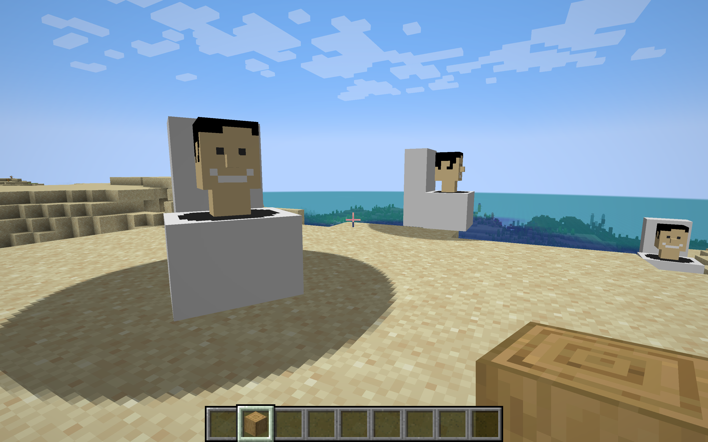

# Scrabo Skibidi
An experimental Skibidi Toilet Minecraft mod. A family side project.



## Pre-requisites
This mod requires Minecraft Java Edition and Forge 1.20.6 (50.1.0) to be installed

## Build
In Terminal, enter:

```
cd scraboskibidi
./gradlew
```

## Install

1. Once build is completed, copy the `scraboskibidi-1.0.0.jar` file from `build/libs/` to your Forge mods folder
2. Launch forge from your Minecraft Launcher

## Usage

The current mod only has one basic toilet that you can summon in creative mode using the command: ```/summon scraboskibidi:toilet ```

## Credits
This mod uses the Forge MDK (50.1.0 1.20.6 RB 1) and code from the [Kaupenjoe Forge Tutorial](https://github.com/Tutorials-By-Kaupenjoe/Forge-Tutorial-1.20.X/tree/28-entity)